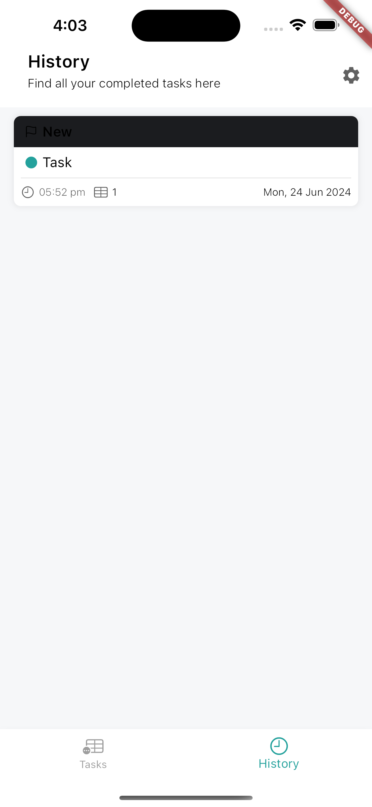

Here's the updated Markdown report including placeholders for the screenshots:

## Brana App Case Study

### Overview
**App Name:** Brana

Brana is a time-tracking and task management app designed to help users efficiently manage their tasks and projects. The app is built using Flutter and adheres to modern software development practices and architectural patterns to ensure a robust and maintainable codebase.

### State Management
- **Stacked:** Utilizes Stacked, a powerful state management solution that wraps Provider. This approach promotes a clear separation between business logic and UI components, facilitating the implementation of the MVVM architecture.

### Routing
- **AutoRouter:** A robust and flexible routing solution that manages the app's navigation. It provides an easy way to define routes and navigate between screens, ensuring a clean and maintainable codebase.

### Architectural Patterns
- **MVVM (Model-View-ViewModel):** Ensures a clear separation between the user interface and the business logic, enhancing testability and maintainability.
- **MVP (Model-View-Presenter):** Facilitates the unit testing of the business logic and helps to separate concerns, ensuring that the presentation layer is independent of the business logic.

### Development Practices
- **TDD (Test-Driven Development):** Writing tests before actual implementation ensures that the code is reliable and robust. This practice helps catch bugs early in the development process.
- **Separation of Business Logic and UI:** Maintaining a clear distinction between business logic and UI components results in a clean and maintainable codebase, making it easier to test and update.

### Code Quality
- **Less Boilerplate Code:** The use of Stacked and other modern Flutter packages minimizes boilerplate code, ensuring that the codebase remains clean and maintainable.
- **Unit Tests:** Comprehensive unit tests are in place to ensure that each component works as expected, contributing to the overall stability and reliability of the app.

### Key Features and Functionalities
1. **Kanban Board for Tasks:**
   - Users can create, edit, and move tasks between columns such as "To Do", "In Progress", and "Done".
   - The Kanban board provides a visual representation of tasks, making it easy to track progress and manage workloads.
   - 

2. **Timer Function:**
   - Allows users to start and stop tracking the time spent on each task.
   - Users can view the total time spent on tasks, helping them manage their time more effectively.
   - 

3. **Task History:**
   - Maintains a history of completed tasks, including the time spent and the date of completion.
   - Users can review past tasks and analyze their productivity over time.
   - 

4. **Comments:**
   - Users can comment on each task to provide updates or feedback.
   - This feature facilitates collaboration and communication among team members.
   - 

5. **Translation:**
   - Supports multiple languages, making the app accessible to a global audience.
   - The app can be easily localized to cater to different regions.
   - 

6. **Multi-Theme:**
   - Allows users to switch between different themes, enhancing the user experience and making the app visually appealing.
   - Users can choose a theme that suits their preferences or work environment.
   - 

7. **Offline Support:**
   - Ensures that the app can function without an internet connection.
   - Data is synchronized when a connection is re-established, providing a seamless user experience.
   - 

### Performance
- **Optimized for Performance:** The app is optimized to ensure fast loading times, smooth scrolling, and minimal use of memory and battery. This enhances the user experience and ensures that the app runs efficiently on all devices.

### Challenges
- **API Limitations:** No external APIs were used as the provided API did not meet the intended functionalities of the app. Instead, local solutions were implemented to fulfill the requirements.

### Screenshots

### Technical Details
- **State Management:** Stacked (Provider)
- **Routing:** AutoRouter
- **Architectural Patterns:** MVVM, MVP
- **Development Practices:** TDD, Separation of Business Logic and UI
- **Languages and Tools:** Flutter, Dart
- **Testing:** Unit Tests
- **Additional Libraries:** EasyLocalization for translations, StackedThemes for theme management

### Future Improvements
1. **Better UI:**
   - Improve the user interface to make it more modern and intuitive.
   - Implement advanced UI/UX principles to enhance the user experience.
   - Incorporate user feedback to refine and enhance the app's design.

2. **More Component Separations:**
   - Further separate components to enhance modularity and reusability.
   - This will also improve testability and maintainability.
   - Develop a more granular component structure to facilitate easier updates and feature additions.

3. **Online Version:**
   - Develop an online version of the app that includes real-time synchronization and cloud storage.
   - This will allow users to access their tasks from any device.
   - Integrate with cloud services to provide seamless data management and synchronization across platforms.

### Non-Functional Requirements
1. **Best Practices:**
   - Followed principles such as DRY (Don't Repeat Yourself), KISS (Keep It Simple, Stupid), and SOLID (Single responsibility, Open-closed, Liskov substitution, Interface segregation, Dependency inversion) to ensure a well-designed and maintainable app.
2. **User-Centered Design:**
   - Focused on making the app easy to use, visually appealing, and accessible to all users.
   - Conducted user testing to gather feedback and make improvements.
3. **Performance Optimization:**
   - Ensured fast loading times, smooth scrolling, and efficient use of resources.
   - Implemented caching and efficient data handling techniques.
4. **Code Readability and Maintainability:**
   - Ensured the code is easy to read, understand, and update, following best practices and design patterns.
   - Used consistent naming conventions and code documentation.
5. **CI/CD (Continuous Integration and Continuous Deployment):**
   - Incorporated continuous integration and deployment practices for faster development cycles, ensuring that the app is always in a deployable state.
   - Automated testing and deployment processes to maintain code quality.

### Additional Information
- **Analytics:** Implemented to track user interactions and identify areas for improvement.
- **Push Notifications:** Reminds users of upcoming tasks or updates, ensuring that they stay on top of their work.
- **Customizable Themes:** Allows users to change the app's appearance to their liking, enhancing personalization.
- **Integration with Third-Party Tools:** Supports integration with other productivity tools to streamline workflows.
- **Multi-Language Support:** Ensures accessibility to a global audience, catering to users from different regions.

### Conclusion
The Brana app is a well-designed, performant, and user-friendly time-tracking and task management application. It adheres to best practices in software development and provides a range of useful features to enhance user productivity and experience. With planned future improvements, Brana aims to become an even more powerful tool for managing tasks efficiently.

### Screenshots

---
